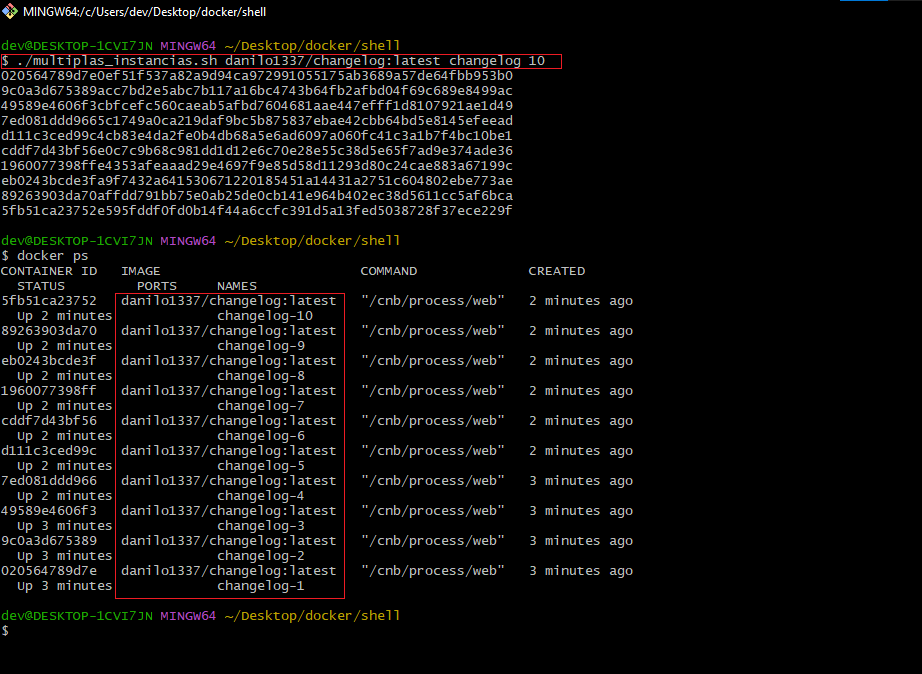
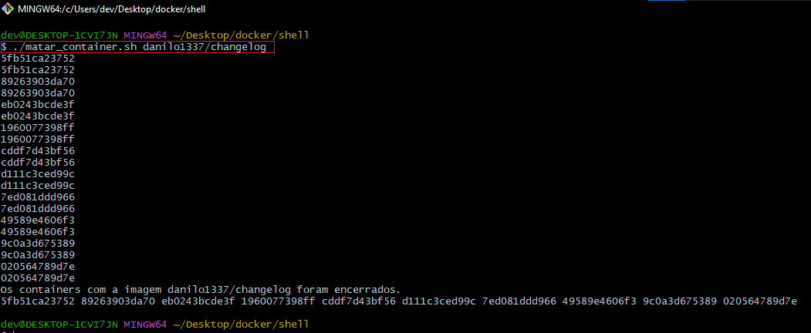
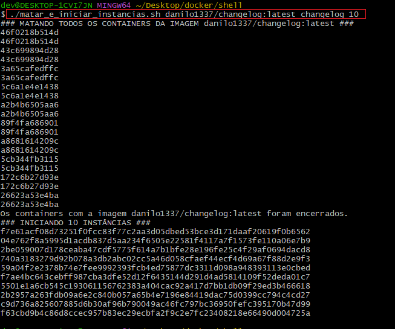

# Scripts MacGyver

## Iniciar várias instâncias de um container

``` shell
$ ./multiplas_instancias.sh danilo1337/changelog:latest changelog 10
```


## Derrubar todos os containers associados a um imagem
``` shell
./matar_container.sh danilo1337/changelog
```



# Derrubar todos os containers associados e inicia várias instâncias de um container
``` shell
./matar_e_iniciar_instancias.sh danilo1337/changelog:latest changelog 10
```
